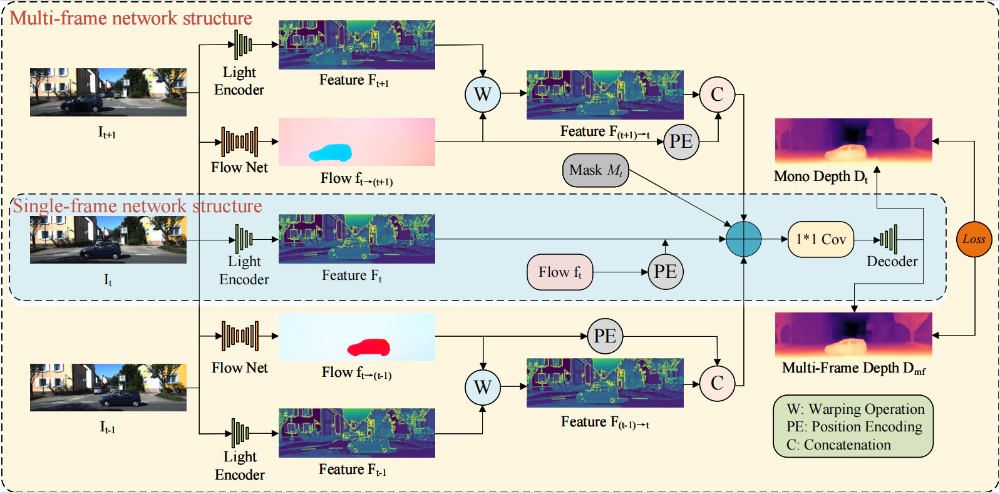
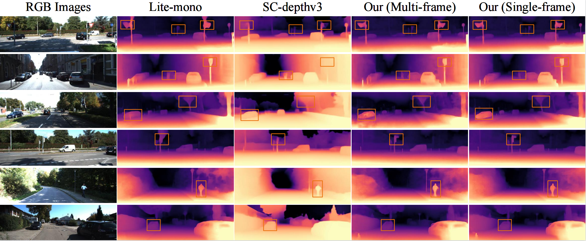

<div id="top" align="center">
  
# MDL-Depth 
**Multi-frame-based Dynamic Scene Lightweight Self-Supervised Monocular Depth Estimation**
  
  Jia Liu, Guorui Lu, Yiyang Wang, Lina Wei, Dapeng Chen*
  
</div>

## Abstract
To address the challenge of self-supervised monocular depth estimation experiencing severe performance degradation in real-world dynamic scenes due to violating the "static world assumption", this paper proposes a unified lightweight single-frame and multi-frame fusion architecture (MDL-Depth). To effectively mitigate interference from moving objects, the method is designed at both the data and loss levels. First, we incorporate a optical flow network to precisely capture pixel-level motion. Through explicit feature warping operations, reference frame features containing dynamic objects are aligned to the target frame's viewpoint, effectively compensating for the independent motion of objects prior to feature fusion. Second, we develop an adaptive loss masking strategy tailored for dynamic foregrounds. By analyzing reprojection errors between consecutive frames, we generate dynamic masks that actively identify and filter out erroneous gradient signals caused by motion mismatches. Experiments on challenging Cityscapes and KITTI datasets demonstrate that our method achieves high accuracy (AbsRel 0.91) in both dynamic and static regions. While ensuring high performance, the framework also prioritizes lightweight design. This provides an effective solution for efficient and precise depth estimation in complex dynamic environments.
## Overview

<p align="center"><strong>The overall structural framework of the proposed lightweight depth estimation method MDL-Depth.</strong></p>

## Comparison of KITTI dataset visualizations



## 🏆 Quantitative Results on KITTI Dataset

This table compares the performance of our MDL-Depth model against state-of-the-art self-supervised monocular depth estimation methods on the challenging KITTI dataset (640x192 resolution).

| Method | Test Frames | Params(M) | AbsRel $\downarrow$ | SqRel $\downarrow$ | RMSE $\downarrow$ | RMSElog $\downarrow$ | $\delta_{1}$ $\uparrow$ | $\delta_{2}$ $\uparrow$ | $\delta_{3}$ $\uparrow$ |
| :--- | :---: | :---: | :---: | :---: | :---: | :---: | :---: | :---: | :---: |
| PackNet-SFM | 1 | 128 | 0.111 | 0.785 | 4.601 | 0.189 | 0.878 | 0.960 | 0.982 |
| Monodepth2 | 1 | 32.5 | 0.115 | 0.903 | 4.863 | 0.193 | 0.877 | 0.959 | 0.981 |
| HR-Depth | 1 | 14.7 | 0.109 | 0.792 | 4.632 | 0.185 | 0.884 | 0.962 | 0.983 |
| MonoFormer | 1 | 23.9 | 0.108 | 0.806 | 4.594 | 0.184 | 0.884 | 0.963 | 0.983 |
| BRNet | 1 | 19.1 | 0.105 | 0.698 | 4.462 | 0.179 | 0.890 | 0.965 | 0.984 |
| Lite-Mono | 1 | 3.1 | 0.107 | 0.765 | 4.461 | 0.183 | 0.886 | 0.963 | 0.983 |
| MonoViT | 1 | 27 | 0.099 | 0.708 | 4.372 | 0.175 | 0.900 | 0.967 | 0.984 |
| Sc-depthv3 | 1 | 14.8 | 0.118 | 0.756 | 4.756 | 0.188 | 0.864 | 0.960 | 0.984 |
| R-MSFM6 | 1 | 3.8 | 0.126 | 0.944 | 4.981 | 0.204 | 0.857 | 0.952 | 0.978 |
| SQLDepth | 1 | 34 | **0.094** | 0.697 | 4.320 | **0.172** | **0.904** | 0.967 | 0.984 |
| DACCN | 1 | 13 | 0.099 | 0.661 | 4.316 | 0.173 | 0.897 | 0.967 | 0.985 |
| Jaeho | 1 | 24.7 | 0.096 | 0.696 | 4.327 | 0.174 | **0.904** | **0.968** | **0.985** |
| **MDL-Depth(Single)** | **1** | **3.0** | 0.098 | **0.646** | **4.235** | 0.174 | **0.904** | **0.968** | **0.985** |
| **---** | **---** | **---** | **---** | **---** | **---** | **---** | **---** | **---** | **---** |
| DepthFormer | 2 | 28.7 | 0.090 | 0.661 | 4.149 | 0.175 | 0.905 | 0.967 | 0.984 |
| DualRefine | 2 | — | 0.090 | 0.658 | 4.237 | 0.171 | 0.912 | 0.967 | 0.984 |
| DynamicDepth | 2 | — | 0.096 | 0.720 | 4.458 | 0.175 | 0.897 | 0.964 | 0.984 |
| ManyDepth | 2 | 26.9 | 0.098 | 0.770 | 4.459 | 0.176 | 0.900 | 0.965 | 0.983 |
| Manydepth2 | 2 | — | 0.091 | 0.649 | 4.232 | 0.170 | 0.909 | **0.968** | **0.985** |
| Mono-ViFi | 3 | 17.9 | 0.099 | 0.661 | 4.321 | 0.174 | 0.898 | 0.966 | **0.985** |
| TC-Depth | 3 | — | 0.103 | 0.746 | 4.483 | 0.185 | 0.894 | 0.966 | 0.983 |
| IFDepth | 3 | 23.9 | **0.089** | 0.716 | 4.186 | 0.169 | **0.914** | **0.969** | 0.984 |
| **MDL-Depth(Multi)** | **3** | **5.8** | 0.091 | **0.620** | **4.126** | **0.168** | 0.906 | **0.969** | **0.985** |


## Data Preparation
Please refer to [Monodepth2](https://github.com/nianticlabs/monodepth2) to prepare your KITTI data.

For Cityscapes dataset, we follow the instructions in [ManyDepth](https://github.com/nianticlabs/manydepth). We need to acquire two archives from the official Cityscapes website: `leftImg8bit_sequence_trainvaltest.zip` and `camera_trainvaltest.zip`. These downloaded files should then be extracted (unzipped) into a common destination folder, which we denote as `/path/to/cityscapes/`.

For the Make3D dataset, the required files can be obtained by downloading them directly from the provided source [here](http://make3d.cs.cornell.edu/data.html#make3d).

## Install

The models were trained using CUDA 11.8, Python 3.9.x (conda environment), and PyTorch 2.4.1.

Create a conda environment with the PyTorch library:

```bash
conda create -n MDL-Depth python=3.9.4
conda install pytorch==2.4.1 torchvision==0.19.1 torchaudio==2.4.1  pytorch-cuda=11.8 -c pytorch -c nvidia
conda activate MDL-Depth
```

Install prerequisite packages listed in requirements.txt:
```bash
pip install -r requirements.txt
```

## Training
The models can be trained on the KITTI dataset by running:
```bash
CUDA_VISIBLE_DEVICES=0 python train.py -c configs/lsm/lsm_KITTI_HR.txt
```

## Inference
To inference on a single image,run:
```bash
python test_simple.py --image_path path/to/your/test/image --pretrained_path path/to/your/weights/folder --backbone LSM --height 192 --width 640 --save_npy
```
## Evaluation
To evaluate single-frame model on KITTI, run:
```bash
CUDA_VISIBLE_DEVICES=0 python evaluate_depth.py \
--pretrained_path path/to/your/weights/folder \
--backbone LSM \
--batch_size 16 \
--width 640 \
--height 192 \
--kitti_path path/to/your/data \
--make3d_path path/to/your/data \
--cityscapes_path path/to/your/data \
```
To evaluate multi-frame model on KITTI, run:
```bash
CUDA_VISIBLE_DEVICES=0 python evaluate_depth_m.py \
--pretrained_path path/to/your/weights/folder \
--backbone LSM \
--mdl_scale small \
--training_data kitti \
--batch_size 16 \
--width 640 \
--height 192 \
--kitti_path path/to/your/data \
--cityscapes_path path/to/your/data \
```
